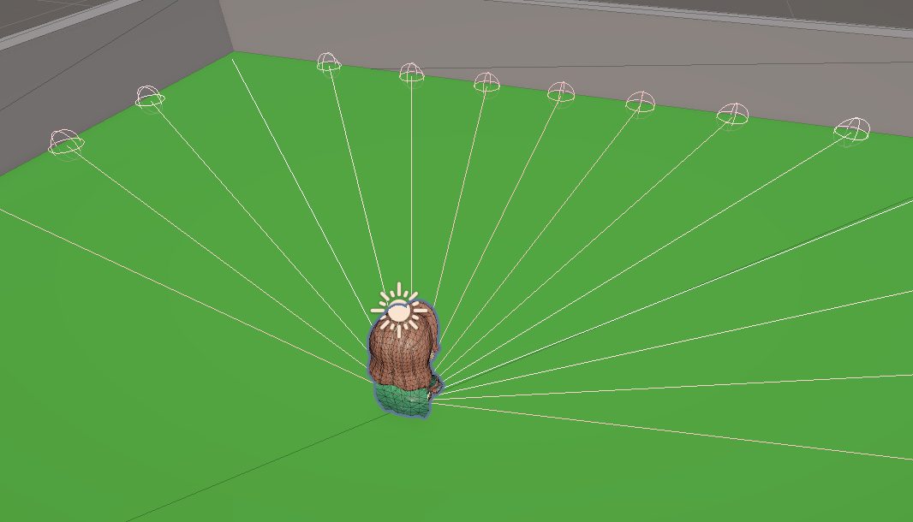
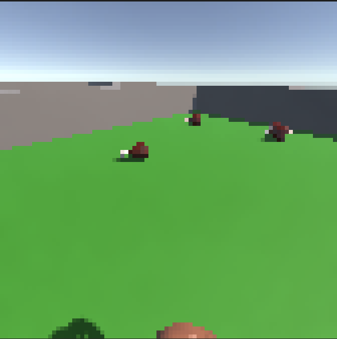
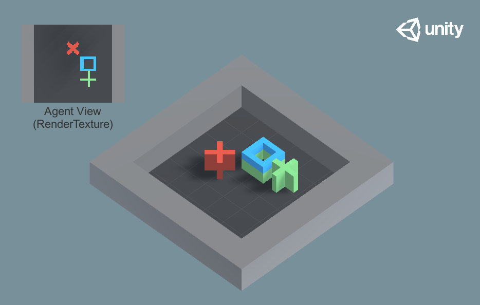
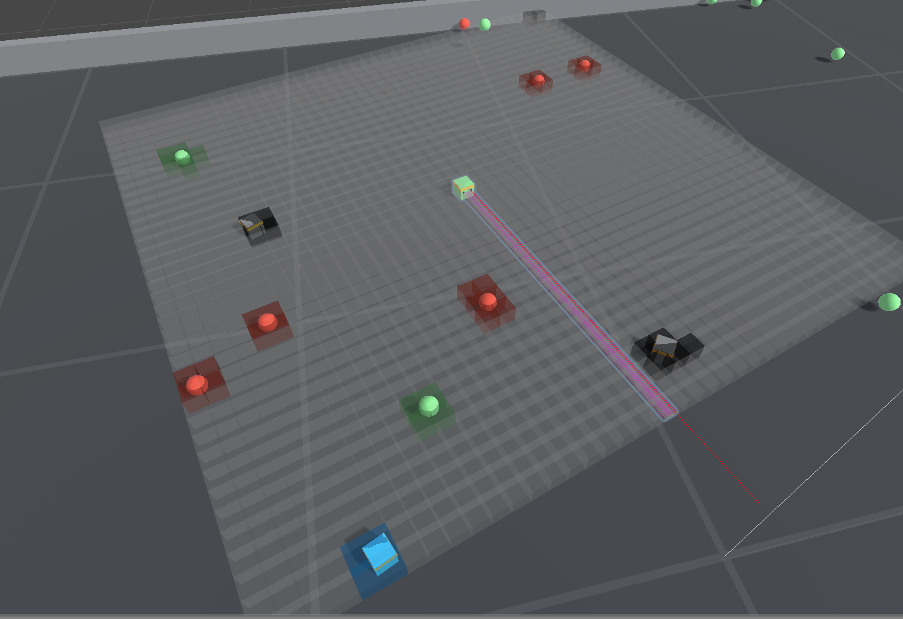
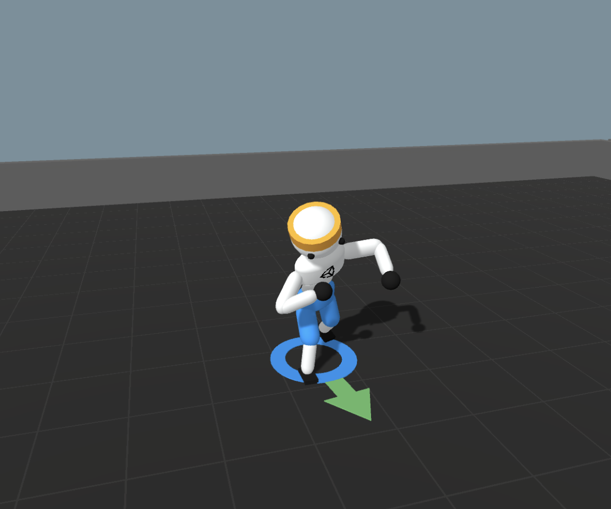

# ML-Agents 센서 정리

에이전트가 환경을 "보는" 방법 = 관측(Observation). ML-Agents는 관측을 만드는 방식이 두 갈래다.

1. **코드로 직접** — `CollectObservations(VectorSensor sensor)`에서 `sensor.AddObservation(...)`로 원하는 값(위치·속도·거리 등)을 직접 넣는다. 가장 유연하지만 무엇을 넣을지 내가 설계해야 한다.
2. **센서 컴포넌트** — GameObject에 컴포넌트만 붙이면 관측이 자동 생성된다. 아래가 그 목록.

> 어느 쪽이든 관측 개수는 Behavior Parameters의 **Vector Observation Space Size**(벡터) 또는 센서 설정과 맞아야 한다.

---

## 주요 센서 컴포넌트

| 센서 | 컴포넌트 | 무엇을 관측 | 언제 쓰나 |
|------|----------|-------------|-----------|
| **Ray Perception** | `RayPerceptionSensorComponent3D` / `2D` | 부채꼴로 레이를 쏴, 맞은 물체의 **태그·거리** | "주변에 뭐가 어디 있나"를 태그로 감지. FoodCollector에서 고기/당근/벽 탐지 |
| **Camera** | `CameraSensorComponent` | 카메라 화면 픽셀(이미지) | 시각 정보 그대로 학습(CNN). 관측이 복잡할 때 |
| **Render Texture** | `RenderTextureSensorComponent` | RenderTexture 픽셀 | 미니맵 등 특정 렌더 결과를 관측 |
| **Grid** | `GridSensorComponent` | 에이전트 주변을 격자로 나눠 각 칸의 물체 감지 | 탑다운 격자 환경(주변 배치를 한눈에) |
| **Buffer** | `BufferSensorComponent` | **개수가 변하는** 물체 목록(각 항목이 벡터) | 적/아이템 수가 매 순간 다를 때. 어텐션으로 처리 |
| **Physics** | `RigidBodySensorComponent` / `JointSensorComponent` | Rigidbody·관절의 물리 상태 | 로봇·관절 제어 |

---

## Ray Perception 핵심 설정

- **Detectable Tags**: 감지할 태그 목록. 여기 넣은 태그별로 관측이 갈린다 → 미리 태그를 만들어 둬야 함.
- **Rays Per Direction**: 정면 기준 좌우로 몇 개씩 쏠지. `N`이면 총 `2N+1`개.
- **Max Ray Degrees**: 부채꼴이 벌어지는 각도.
- **Ray Length**: 레이 사거리(감지 거리).
- **Sphere Cast Radius**: 레이 두께.

레이 하나가 주는 값 = `(태그 원-핫) + 안 맞음 여부 + 맞은 거리`. 태그 수와 레이 수가 늘면 관측 크기가 커진다.

---

## Camera 핵심 설정

- **Camera**: 관측으로 쓸 카메라(에이전트 시점 카메라를 따로 두는 게 보통). 정보를 가리지 않아야 함.
- **Width / Height**: 관측 이미지 해상도. 기본 `84×84` (은 너무 클 수 있다). 키우면 정보량↑·학습 비용↑. 낮은 해상도에서 직접 플레이해보고 "이정도면 할 수 있겠다"로 맞추기
- **Grayscale**: 흑백으로 관측(색이 필요 없으면 켜서 채널 3→1로 경량화).
- **Compression Type**: `PNG` 압축이면 전송량↓(기본 권장), `None`이면 무압축.
- **Observation Stacks**: 최근 N프레임을 쌓아 관측(움직임·속도 감지에 필요).

> 이미지 관측은 Behavior Parameters가 **CNN 인코더**를 자동으로 쓴다. 벡터 관측보다 무겁다.

---

## Render Texture 핵심 설정

Camera와 거의 동일하되, 카메라 대신 **RenderTexture 에셋**을 관측한다.

- **Render Texture**: 관측할 RenderTexture(미니맵·특수 렌더 결과 등).
- **Grayscale / Compression Type**: Camera와 동일.

> 카메라를 실시간으로 안 옮겨도 되는, 이미 렌더된 결과(미니맵 등)를 관측할 때.

---

## Grid 핵심 설정

에이전트 주변을 격자로 훑어, 칸마다 어떤 태그 물체가 있는지 관측.

- **Cell Scale**: 칸 하나의 실제 크기(월드 단위). 격자 해상도.
- **Grid Size**: 칸 개수 `(X, Y, Z)`. 보통 Y=1(평면). 넓게 볼수록 관측↑.
- **Detectable Tags**: 감지할 태그(Ray와 같은 개념).
- **Collider Mask**: 감지할 레이어. 불필요한 물체 제외해 성능 확보.
- **Rotate With Agent**: 켜면 격자가 에이전트 회전을 따라 돈다(에이전트 기준 시야).

---

## Buffer 핵심 설정

개수가 매 스텝 바뀌는 물체(적·아이템)를 다루는 가변 길이 관측.

- **Observable Size**: 항목 하나를 표현하는 관측 벡터 길이(예: 상대위치 3개면 3).
- **Max Num Observables**: 버퍼에 담을 최대 항목 수. 이보다 많으면 잘리고, 적으면 0 패딩.
- **채우기는 코드로**: 매 스텝 `CollectObservations`에서 항목마다 `bufferSensor.AppendObservation(float[])` 호출.

> 내부적으로 어텐션으로 처리해 순서·개수에 무관하게 학습된다.

---

## Physics (RigidBody / Joint) 핵심 설정

로봇·관절처럼 물리 상태 자체가 관측인 경우.

- **Root Body**: 관측의 기준이 되는 루트 Rigidbody.
- **Virtual Root**: 상대 좌표 기준으로 삼을 오브젝트(있으면 그 기준으로 위치 관측).
- **Settings**: 각 body별로 위치·회전·속도를 **월드/모델 공간** 중 무엇으로 관측할지 토글.
- **Joint**(JointSensor): 관측할 관절(ConfigurableJoint 등)을 지정.

---

## 공통 옵션

여러 센서에 반복 등장하는 것들:

- **Sensor Name**: 관측 식별용 이름. 한 에이전트에 같은 종류 센서를 여러 개 붙이면 **서로 달라야** 한다.
- **Observation Stacks**: 최근 N개 관측을 쌓아 시간 변화(속도·방향)를 학습에 반영. 정적 관측엔 1.
- **Compression Type**: 이미지 계열(Camera/Render/Grid)에서 전송량 절약(`PNG` vs `None`).

---

## 고르는 기준 (요약)

- 물체 위치를 **태그로** 알면 됨 → **Ray Perception** (가볍고 학습 빠름, 대부분 여기서 시작)
- 관측이 **이미지처럼 복잡** → **Camera / Render Texture** (무겁고 CNN 필요)
- 주변을 **격자로** 보고 싶다 → **Grid**
- 관측 대상 **개수가 매번 다르다** → **Buffer**
- 딱 정해진 수치 몇 개(속도·거리 등)면 → 센서 없이 **`CollectObservations`로 직접**
