# TensorBoard 읽기 — ML-Agents 학습 지표

`mlagents-learn`으로 학습하는 동안 무슨 일이 일어나는지는 TensorBoard의 스칼라 그래프로 본다. 이 문서는 각 지표가 **무엇을 뜻하고 · 어떤 모양이 정상이며 · 이상하면 무슨 신호인지** 정리한 것. (트레이너는 PPO, reward_signals는 `extrinsic`만 쓰는 FoodCollector 기준)

---

## 0. 실행 & 보는 법

학습을 돌리면 `results/<run-id>/` 아래에 이벤트 로그가 쌓인다. TensorBoard는 이 폴더를 가리키게 실행한다:

```bash
tensorboard --logdir results
# 브라우저에서 http://localhost:6006
```

- **run-id별로 색이 갈린다.** `--logdir results`로 상위 폴더를 열면 여러 번 돌린 실험(run)이 한 그래프에 겹쳐 그려져 **비교**할 수 있다. 하이퍼파라미터 바꿔가며 비교할 때 핵심.
- **Smoothing(왼쪽 사이드바 슬라이더).** 원본 곡선은 노이즈가 심하다. 0.6~0.9쯤 주면 추세가 보인다. 단, 스무딩은 착시를 줄 수 있으니 **연한 원본 선**도 같이 보기.
- **스칼라 값이 뜨는 주기 = `summary_freq`**(YAML). 너무 크면 그래프가 듬성듬성, 너무 작으면 노이즈. 보통 1만~5만.
- **가로축**은 기본이 `Step`(환경 스텝 수). 오른쪽 위에서 상대 시간(wall)으로도 바꿀 수 있다.

> 곡선 하나만 보고 판단하지 말 것. "보상이 오르는가(Environment)"를 먼저 보고, 이상하면 Losses·Policy로 원인을 좁힌다.

---

## 1. Environment (환경 관련)

- **Cumulative Reward**: 에피소드당 누적 보상. **"학습이 잘 되고 있나"의 최우선 지표.** 우상향하다가 후반부에 평평해지는(수렴) 모양이 이상적. 계속 0 근처거나 요동만 치면 보상 설계·관측·행동 중 뭔가 어긋난 것. 
  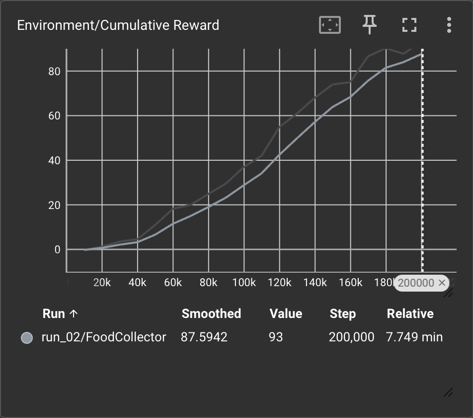
- **Cumulative Reward (Histogram 탭)**: 보상값의 **분포**가 스텝에 따라 어떻게 바뀌는지 보여주는 히스토그램. 분포가 오른쪽(높은 보상)으로 이동 = 정책이 좋아지는 중. 분포가 넓게 퍼져 있으면 에이전트별 성능 편차가 크다는 뜻(운/초기위치 의존).
  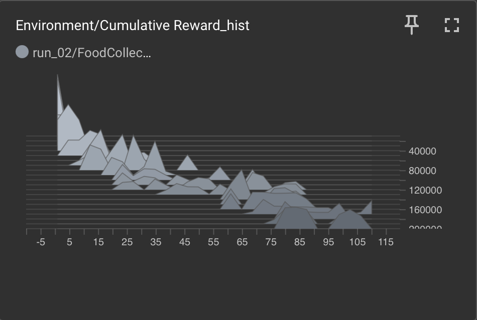
- **Episode Length**: 에피소드가 몇 스텝 만에 끝나는지. MaxStep 타임아웃까지 항상 채우면 평평하다. **조기 종료 문제**(떨어짐/실패로 `EndEpisode` 호출)를 여기서 발견한다. 과제에 따라 "빨리 끝내는 게 좋은" 경우엔 오히려 줄어드는 게 정상.
  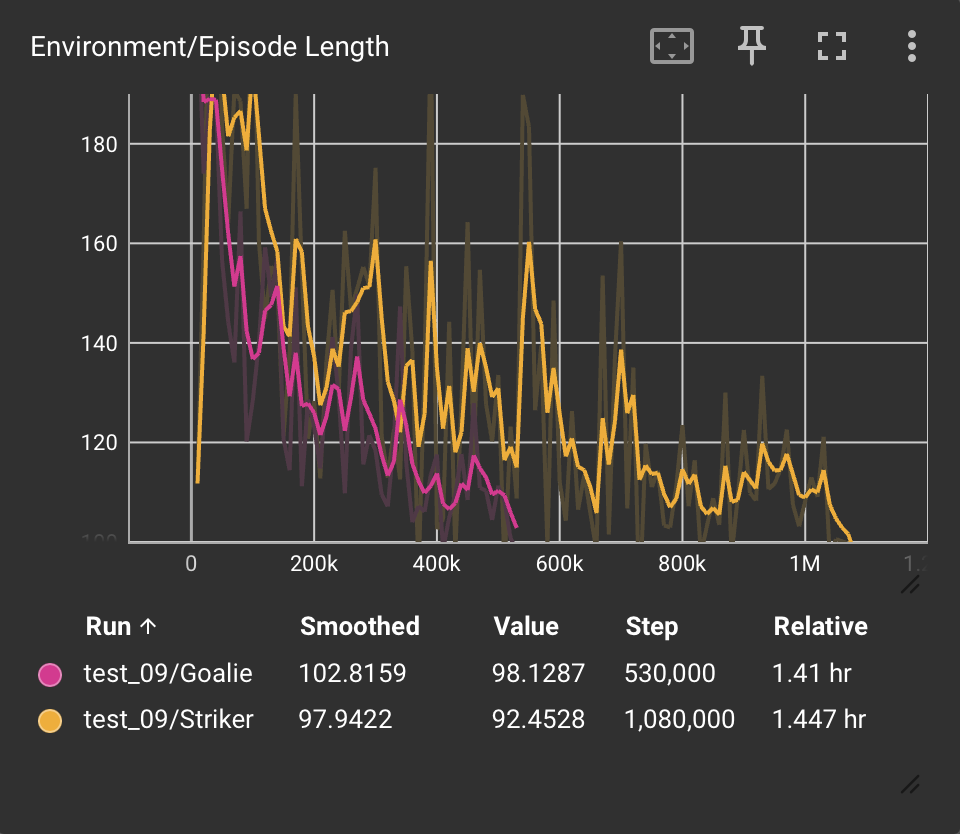

---

## 2. Losses

여기 값들은 **절대 크기보다 추세**가 중요하다. "0에 가까워야 좋다"는 지도학습식 직관을 그대로 적용하면 안 됨.

- **Policy Loss**: PPO의 clipped surrogate loss. 작은 값 근처에서 진동하는 게 정상. 학습이 진행되며 대체로 감소한다. 계속 커지거나 발산하면 학습률이 높거나 관측/보상 스케일이 튀는 것.
  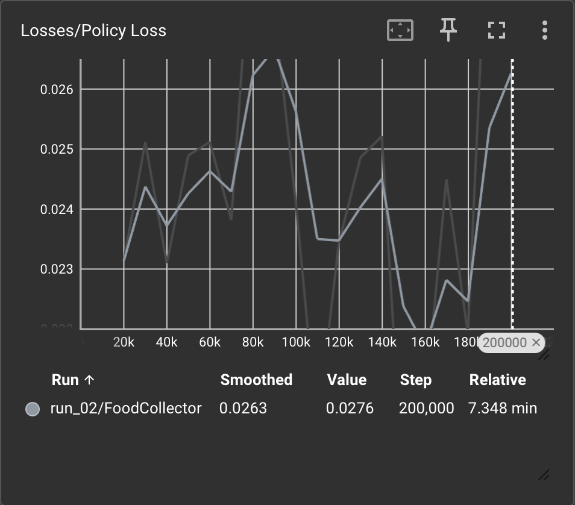
- **Value Loss**: 크리틱(가치함수)의 예측 오차. **초반엔 낮다가 보상이 커지면서 같이 증가한 뒤 안정**되는 게 정상 — 가치 추정이 커진 보상 스케일을 따라잡는 자연스러운 패턴. 끝까지 계속 치솟기만 하면 가치함수가 못 따라잡는 것(보상 스케일이 너무 크거나 불안정).
  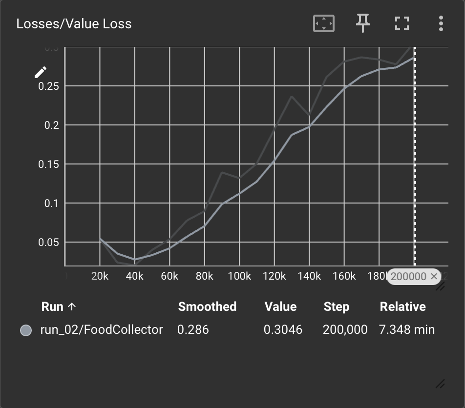

---

## 3. Policy

- **Entropy**: 정책 행동 분포의 무작위성(=탐색 정도). **감소 중 = 탐색에서 활용으로 전환**되는 정상 흐름. 너무 빨리 0으로 꺼지면 조기 수렴(탐색 부족) → `beta`를 키운다. 반대로 안 떨어지면 학습이 안 잡히는 것.
  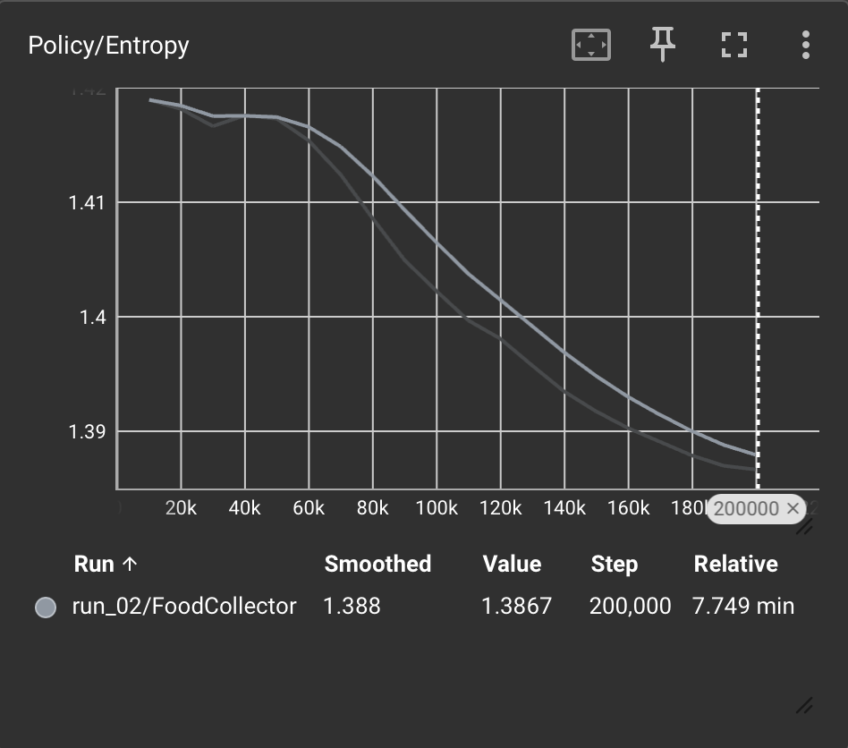
- **Beta**: 엔트로피 보너스 계수. 탐색을 강제하는 힘. 설정한 스케줄대로 선형 감소.
  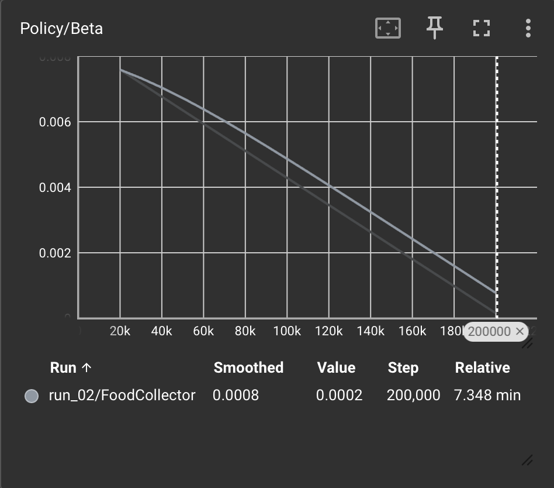
- **Epsilon**: PPO 클리핑 범위. `learning_rate_schedule: linear`이면 이것도 선형으로 줄어든다.
  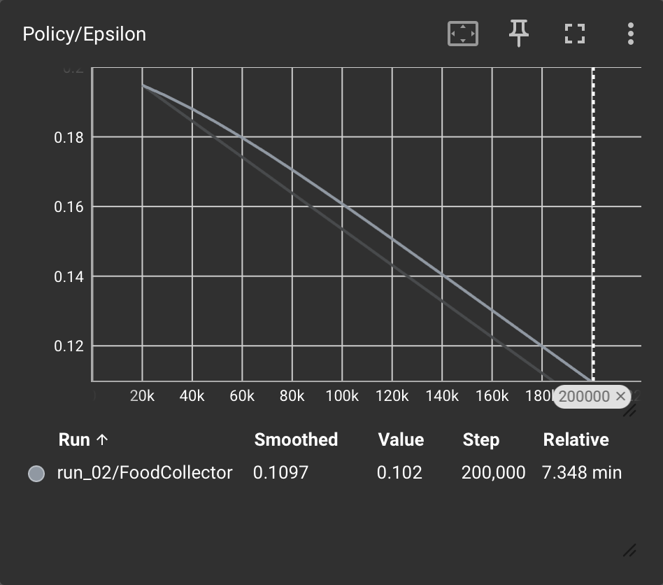
- **Learning Rate**: 학습률. `linear` 스케줄이면 0을 향해 선형 감소. `constant`면 평평.
  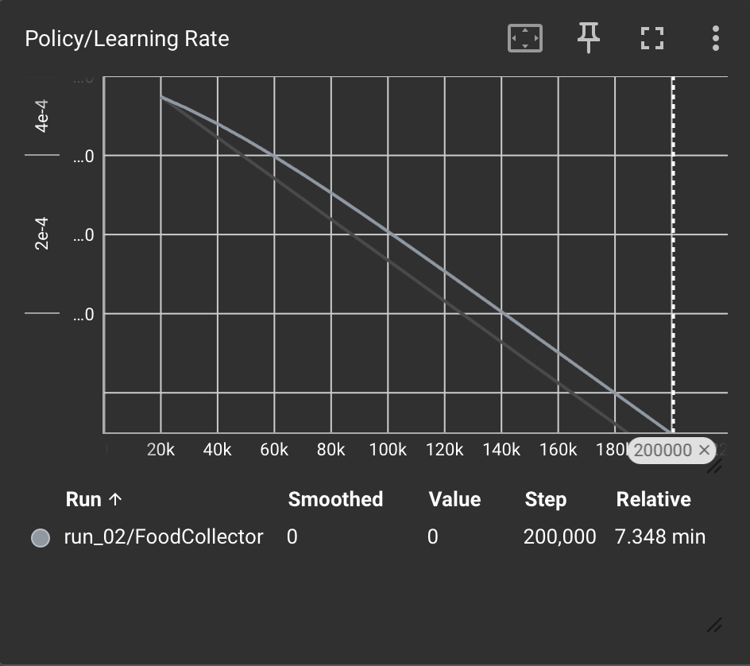
- **Extrinsic Reward**: reward_signals에 `extrinsic`만 썼으므로 Cumulative Reward와 사실상 같은 값. "정책 쪽 관점"으로 본 보상이라 보면 된다.
  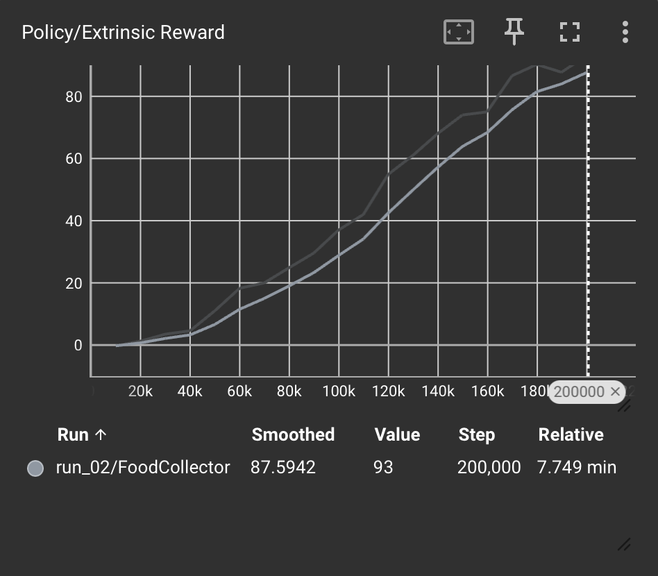
- **Extrinsic Value Estimate**: 크리틱이 예측한 상태가치. **실제 보상 곡선과 같이 우상향**해야 학습이 제대로 되는 것. 실제 보상은 오르는데 이 값이 안 따라오면 크리틱이 뒤처진 것(Value Loss와 함께 본다).
  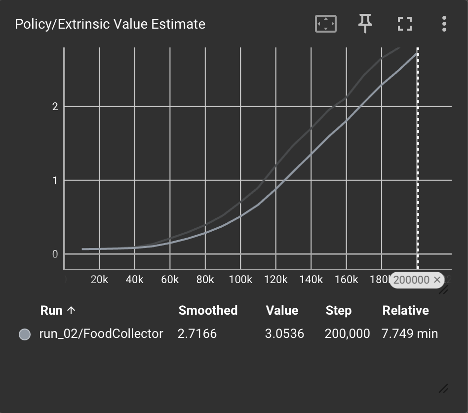

> **참고 — 다른 reward signal을 쓰면** 여기에 항목이 더 생긴다. `curiosity`를 켜면 `Curiosity Reward` / `Curiosity Value Estimate`(Policy)와 `Curiosity Forward/Inverse Loss`(Losses)가, `gail`을 켜면 `GAIL Reward`·`GAIL Loss` 등이 추가된다. FoodCollector는 extrinsic만 쓰므로 해당 없음.

---

## 4. 패턴으로 빠르게 진단하기

| 증상 | 유력한 원인 | 먼저 볼 것 |
|------|-------------|-----------|
| Cumulative Reward가 안 오름 | 보상 설계/관측/행동 문제 | 보상이 실제로 지급되는지 코드 확인, Episode Length |
| 보상이 오르다가 꺾여 내려감 | 학습률 과대, 불안정 | Learning Rate, Policy/Value Loss 발산 여부 |
| 초반에 좋다가 정체 | 조기 수렴(탐색 부족) | Entropy가 너무 빨리 떨어졌는지 → `beta`↑ |
| Value Loss가 끝까지 폭증 | 보상 스케일 과대/불안정 | 보상 크기 축소, Extrinsic Value Estimate 추종 여부 |
| Episode Length가 예상보다 짧음 | 원치 않는 조기 종료 | `EndEpisode` 호출 조건 재확인 |
| 값이 아예 안 뜸 | run-id 폴더 오지정 | `--logdir`가 `results` 상위인지, `summary_freq` |

---

## 요약

1. **Environment/Cumulative Reward**를 먼저 본다 — 우상향 후 수렴이면 성공.
2. 안 되면 **Losses·Policy**로 원인을 좁힌다(발산? 탐색 부족? 크리틱 뒤처짐?).
3. Losses는 절대값이 아니라 **추세**로 읽는다. Value Loss가 중간에 오르는 건 정상.
4. 실험을 바꿀 땐 **run-id를 나눠** 겹쳐 비교한다.
