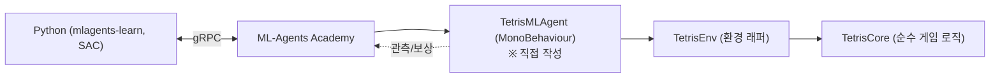

# TetrisAgent — ML-Agents(SAC) 학습 가이드

이 문서는 지금 레포에 뭐가 있는지 이해하고, SAC로 테트리스를 학습시키기까지 스스로 코드를 채워 넣을 수 있게 하는 **길잡이**다. 스켈레톤과 "여기서 뭘 결정해야 하는지"만 주고,
보상 설계·하이퍼파라미터·관측 확장 같은 **핵심 판단은 비워 뒀다.** 빈칸(`TODO`)은 직접 채워라.

---

## 0. 큰 그림



- **학습 알고리즘(SAC)** 은 Python 쪽에 있다. Unity는 "환경"만 제공한다.
- 네가 새로 만들 건 딱 하나, **`TetrisMLAgent`** (ML-Agents `Agent`를 상속한 MonoBehaviour).
  나머지(`TetrisCore`, `TetrisEnv`)는 이미 있고, Agent는 그걸 호출만 한다.

---

## 1. 지금 있는 코드

`Assets/Scripts/` 에 세 파일이 있다. **로직 / 렌더 / 에이전트-인터페이스를 일부러 분리**해 놨다.

| 파일 | 역할 | 학습에 쓰나? |
|---|---|---|
| `TetrisCore.cs` | 순수 C# 게임 로직. Unity 비의존. 보드/조각/회전(SRS)/라인클리어/점수/게임오버 | ○ (간접) |
| `TetrisBoard.cs` | 스프라이트 렌더. 사람 플레이(`autoPlay`) 또는 **에이전트 코어 관전(`Bind`)** | △ (관전용, 선택) |
| `TetrisEnv.cs` | 에이전트용 환경 래퍼. 고수준 배치 액션 + 관측 + 결과 | ○ (핵심) |

### 1-1. `TetrisEnv` 가 에이전트에게 주는 것

```csharp
new TetrisEnv(seed);            // 환경 하나 생성 (내부에 TetrisCore 소유)
env.Reset();                    // 에피소드 시작
env.Step(action);               // 이산 액션 0..39 실행 → StepResult
env.Step(column, rotation);     // 또는 (열, 회전) 직접
env.IsValid(action);            // 그 액션이 지금 가능한가 (마스킹용)
env.GetObservation();           // float[214] 관측 벡터
env.IsDone;                     // 게임오버?
```

- **액션 공간**: 이산 `ActionCount = 40` = 열 10 × 회전 4.
  `Step`이 조각을 목표 위치로 정렬한 뒤 **즉시 하드드롭해 고정**한다. → *"한 조각 놓기"가 곧 한 액션.*
- **관측**: `ObservationSize = 214` = 보드 점유 200(10×20, 0/1) + 현재 조각 one-hot 7 + 다음 조각 one-hot 7.
- **결과**(`StepResult`): `valid`, `linesCleared`, `scoreDelta`, `gameOver`.
  → **보상은 본인이 설계**

> **중요한 사고 전환:** 배치형 액션이라 조각은 즉시 락된다.
> 학습에는 중력/락딜레이(`Tick`), 렌더, 키보드 입력이 **전혀 필요 없다.** `PlacePiece` 하나로 한 스텝이 끝난다.

### 결정할 것
- 관측 214차원으로 충분한가? (구멍 수, 열별 높이, bumpiness 같은 **특징을 추가**하면 학습이 빨라질 수 있다. 대신 관측 크기도 바뀜)
- 관측값 차원을 줄일 순 없을까? (2차원 배열 그대로 넣지 말고 열별 높이 + 구멍수 + bumpiness로 해결하는 방법?)
- 다음 조각 1개만 보여줄지, 홀드/넥스트 여러 개까지 관측에 넣을지.

---

## 2. RL 문제로 정의하기

강화학습은 결국 `(관측 → 액션 → 보상)` 루프다. 아래 4개를 결정해야 한다.

1. **State(관측)** — 위 214차원이 출발점. 필요하면 확장.
2. **Action** — 이산 40. 변경은 비추.
3. **Reward(보상)** — 아래 "재료"를 조합해 스스로 설계. 값·부호·스케일이 학습 성패를 가른다.
   - 라인 클리어: `linesCleared` 로 보상 (1/2/3/4줄에 **비선형 가중**을 줄지 고민 — 테트리스 장려)
   - 생존/진행: 한 조각 놓을 때마다 아주 작은 +
   - 게임오버: 큰 음수 페널티 (`gameOver`)
   - (선택) 보드 상태 패널티: 구멍 수↑, 최대 높이↑, 열 높이 편차↑ → 음수. *shaping* 은 강력하지만 과하면 편향된다.
   - 무효 액션(`valid == false`): 마스킹을 쓰면 애초에 안 나오지만, 안 쓰면 페널티로 처리.
4. **Episode 종료** — `gameOver` 시 `EndEpisode()`. 또는 목표(예: N줄) 도달 시 종료(스프린트).

### 결정할 것
- 보상 스케일을 대략 `[-1, +1]` 근처로 정규화할지. (SAC는 보상 스케일에 민감)
- 마스킹으로 무효 액션을 막을지(권장) vs 페널티로 학습시킬지.

---

## 3. Agent 작성 (`TetrisMLAgent.cs` 스켈레톤)

ML-Agents `Agent`는 **4~5개 콜백**만 구현하면 된다. 아래는 뼈대다. `TODO`가 네 몫.

```csharp
using Unity.MLAgents;
using Unity.MLAgents.Actuators;
using Unity.MLAgents.Sensors;
using UnityEngine;
using Tetris;

public class TetrisMLAgent : Agent
{
    [SerializeField] TetrisBoard viewBoard;   // (선택) 관전용 보드. 비워두면 렌더 안 함.
    TetrisEnv env;

    public override void Initialize()
    {
        env = new TetrisEnv(/* seed: 0 = 매번 랜덤 */);
        if (viewBoard != null) viewBoard.Bind(env.Core);   // (선택) 이 에이전트 보드를 화면에 렌더
    }

    public override void OnEpisodeBegin()
    {
        env.Reset();
    }

    public override void CollectObservations(VectorSensor sensor)
    {
        // env.GetObservation() 의 214개 값을 sensor에 넣는다.
        // TODO: foreach 로 AddObservation.
    }

    public override void WriteDiscreteActionMask(IDiscreteActionMask mask)
    {
        // 무효 배치를 아예 후보에서 제거 → 학습 훨씬 수월.
        // TODO: for a in 0..TetrisEnv.ActionCount: if (!env.IsValid(a)) mask.SetActionEnabled(0, a, false);
    }

    public override void OnActionReceived(ActionBuffers actions)
    {
        int a = actions.DiscreteActions[0];
        var r = env.Step(a);            // ← 조각 한 개 배치 = 한 스텝

        // TODO: r.linesCleared / r.scoreDelta / r.valid / r.gameOver 로 보상 설계

        if (r.gameOver)
            EndEpisode();
    }

    // (선택) 사람이 키로 테스트할 때만. 학습엔 불필요.
    public override void Heuristic(in ActionBuffers actionsOut)
    {
        // TODO: 디버그용. 없어도 됨.
    }
}
```

### 결정/주의할 점
- **결정 주기**: 이 GameObject에 `Decision Requester` 컴포넌트를 붙이고 **Decision Period = 1**로 두면
  매 스텝 자동으로 결정을 요청한다. `OnActionReceived`에서 배치가 정확히 1번 일어나므로 *결정 1회 = 조각 1개*로 딱 맞는다.
  (수동으로 `RequestDecision()`를 호출하는 방법도 있다 — 왜 그렇게 하고 싶은지 이해했다면.)
- **Update/Tick 없음**: 학습 Agent는 프레임 루프가 필요 없다. 중력·렌더는 신경 쓰지 마라.
- **시각화(선택, 지원됨)**: `TetrisBoard`를 `autoPlay=false`로 두고 `board.Bind(env.Core)`만 호출하면
  그 에이전트의 보드가 화면에 그려진다(입력·중력 없이 렌더만). 세팅은 4-1절.

---

## 4. 씬 & 컴포넌트 세팅

학습용으로는 **렌더 없는 가벼운 씬**을 새로 만드는 걸 추천(예: `Assets/Scenes/Train.unity`).

1. 빈 GameObject 생성 → `TetrisMLAgent` 스크립트 부착.
2. 같은 오브젝트에 **Behavior Parameters** 컴포넌트가 자동으로 붙는다. 다음의 내용을 설정:
   - **Behavior Name**
   - **Vector Observation > Space Size**
   - **Actions > Continuous**: `0`
   - **Actions > Discrete Branches**: `1`, **Branch 0 Size**: `40`
   - **Model**: 비워 둠
3. **Decision Requester** 컴포넌트 부착, **Decision Period = 1**.
4. **병렬 학습**: 이 오브젝트를 여러 개 복제(또는 프리팹화 후 여러 개 배치)하면 경험 수집이 빨라진다.

### 4-1. 학습을 보면서 하기 (관전)

`TetrisBoard`는 `autoPlay=false`면 자기 코어를 만들지 않고, `Bind(core)`로 받은 외부 코어를
**입력·중력 없이 렌더만** 한다. 그래서 에이전트의 `env.Core`를 그대로 화면에 띄울 수 있다.

1. 관전할 씬에 `TetrisBoard` GameObject를 하나 두고 블록 스프라이트 7개를 연결(SampleScene 것 복사).
   Inspector에서 **`autoPlay` 체크 해제.**
2. 카메라를 보드가 보이게 맞춘다(직교, SampleScene 세팅 참고).
3. 에이전트 오브젝트의 `viewBoard` 슬롯에 그 보드를 연결. → `Initialize()`의 `Bind` 한 줄이 나머지를 처리.

- **하나만 관전**: 병렬 에이전트가 여러 개여도 `viewBoard`를 연결한 **하나만** 그려진다(나머진 비워둠).
- **속도**: Timescale을 올리면 조각이 순식간에 쌓여 안 보인다. 눈으로 볼 땐 Timescale 1,
  또는 학습된 `.onnx` 추론(7절)으로 관전하면 편하다.
- 렌더는 로직과 분리돼 있어 **학습 결과엔 영향 없다**(약간의 성능 오버헤드만).

---

## 5. SAC 설정 파일 (`configs/tetris_sac.yaml` 스켈레톤)

값은 **출발점**일 뿐 — 직접 튜닝하라. `Tetris`는 Behavior Name과 반드시 일치.

```yaml
behaviors:
  Tetris:                          # ← Behavior Name 과 동일해야 함
    trainer_type: sac
    max_steps: 5000000             # 총 학습 스텝 (테트리스는 넉넉히)
    time_horizon: 64
    summary_freq: 20000
    keep_checkpoints: 5

    hyperparameters:
      learning_rate: 3.0e-4
      learning_rate_schedule: constant   # SAC 기본값(감쇠 X)
      batch_size: 256
      buffer_size: 500000                # SAC는 크게 (리플레이 버퍼)
      buffer_init_steps: 2000            # 학습 전 랜덤 수집량 → 초반엔 조용한 게 정상
      init_entcoef: 1.0                  # 초기 탐험 강도 (이산은 낮춰볼 수도)
      tau: 0.005                         # 타깃 네트워크 갱신 속도
      steps_per_update: 10.0             # (에이전트 스텝 : 업데이트) 비율
      save_replay_buffer: false

    network_settings:
      hidden_units: 256
      num_layers: 2
      normalize: false                   # 관측이 이미 0/1·one-hot이면 보통 불필요

    reward_signals:
      extrinsic:
        gamma: 0.99
        strength: 1.0
```

### 튜닝 감각 (왜 그런지 이해하고 만지기)
- `buffer_size` / `buffer_init_steps`: SAC는 off-policy라 리플레이 버퍼가 핵심. 너무 작으면 불안정.
- `init_entcoef`: 탐험량. 이산 액션 40개면 초반 탐험이 과할 수 있으니 조정 여지.
- `batch_size` / `steps_per_update`: 표본 효율 ↔ 속도 트레이드오프.
- `gamma`: 라인 클리어처럼 **지연 보상**이 중요하면 크게(0.99+).

---

## 6. 학습 실행 & 관찰

```bash
mlagents-learn configs/tetris_sac.yaml --run-id=tetris_sac_01
# 콘솔에 "Start training by pressing Play in the Unity Editor" 뜨면 → 에디터에서 ▶ Play
```

- 중단 후 이어서: `--resume` / 같은 run-id 덮어쓰기: `--force`
- **지표 보기**: `tensorboard --logdir results` → 브라우저.
  먼저 볼 것: `Environment/Cumulative Reward`(우상향?), `Policy/Entropy`(줄어드는지), `Losses/*`.
- 사람보다 훨씬 빠르게 돌리려면 에디터 우측 상단 **Timescale**(또는 config `--time-scale`)을 올린다.

---

## 7. 학습된 모델로 플레이(추론)

1. `results/<run-id>/Tetris.onnx` 생성됨.
2. Behavior Parameters의 **Model**에 그 `.onnx` 할당.
3. **Behavior Type = Inference Only** 로 두고 Play.
4. 시각화는 4-1절과 동일 — `TetrisBoard`(autoPlay off)를 `viewBoard`에 연결하면 됨.

---

## 8. 체크리스트 (막히면 여기부터)

- [ ] Behavior Name == YAML의 behaviors 키
- [ ] Space Size == `GetObservation()` 길이(기본 214). 관측 바꿨으면 숫자도 바꿈
- [ ] Discrete Branch 0 Size == 40, Continuous == 0
- [ ] Decision Requester(Period 1) 부착 — 없으면 결정을 안 해서 학습이 안 됨
- [ ] `OnActionReceived`에서 `EndEpisode()`를 게임오버 때 호출하는가
- [ ] 보상 스케일이 폭주하지 않는가(대략 [-1,1])
- [ ] 무효 액션 처리(마스킹 or 페널티) 했는가
- [ ] Unity 패키지 ↔ pip mlagents 버전 정합
- [ ] 초반에 리워드가 안 움직여도 `buffer_init_steps`만큼은 랜덤 수집 구간이라 정상
- [ ] (관전 시) `TetrisBoard` autoPlay 꺼짐 + `viewBoard` 연결 + `Initialize`에서 `Bind` 호출

---

## 참고 링크
- [ML-Agents: Agent 설계](https://unity-technologies.github.io/ml-agents/Learning-Environment-Design-Agents/)
- [Training Configuration File (SAC 포함)](https://github.com/Unity-Technologies/ml-agents/blob/main/docs/Training-Configuration-File.md)
- [설치 가이드](https://unity-technologies.github.io/ml-agents/Installation/)

> 이 문서의 코드 조각은 **뼈대**다. 그대로 붙여넣어 돌리는 대신, 각 `TODO`에서
> "왜 이게 필요한가 / 어떤 값이 맞는가"를 스스로 답하며 채워라. 그게 이번 스터디의 목표다.
